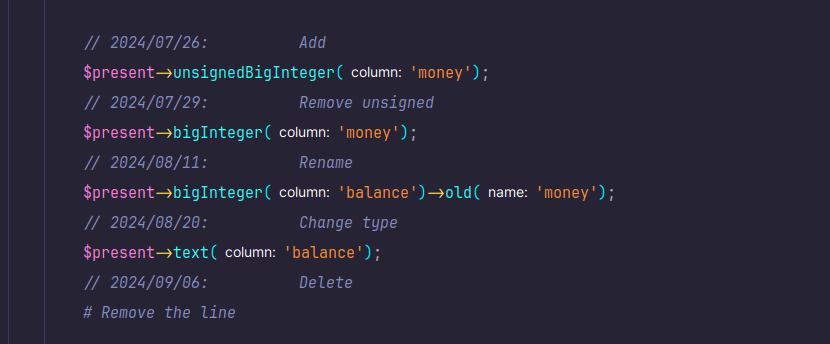
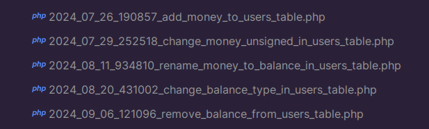

# Laplus
Laravel plus+ add presentation for your models

```php
public function present()
{
    $this->id();
    $this->text('title');
    $this->string('password')->cast('hashed')->hidden();
    $this->belongsTo(Artist::class)->cascadeOnDelete();
}
```

Write your presents in long time:



Laplus will generate your migrations:




## Requirements
* Php 8.2 or higher
* Laravel 11.0


## Installation
### 1- Install the package with composer:
```shell
composer require rapid/laplus
```

### 2- Publish configs
Run this command to publish configs to `config/laplus.php`
```shell
php artisan vendor:publish --tag=laplus
```

### 3- Convert default User model to presentable model (optional):
+ Add `HasPresent` trait:
```php
class User extends Model
{
    use HasPresent;
}
```

+ Remove `$fillable`, `$hidden` and `casts()` values:
```php
//protected $fillable = ['name', 'email', 'password'];
//protected $hidden = ['password', 'remember_token'];
//protected function casts() { ... }
```
> Laplus will automatically add this values.

+ Create `UserPresent` class with the following command:
```shell
php artisan make:user-present
```
Or add below code in User class:
```php
protected function present(Present $present)
{
    $present->id();
    $present->string('name');
    $present->string('email')->unique();
    $present->timestamp('email_verified_at')->nullable();
    $present->password();
    $present->rememberToken();
    $present->timestamps();
}
```

+ Move default migration to laplus path:

Find `database/migrations/0001_01_01_000000_create_users_table.php` file and move it
    into `database/migrations/auto_generated` folder (create it if doesn't exists)


## Make model & present
You can use this command to create a model and a present:
```shell
php artisan make:model-laplus Name
```
Or:
```shell
php artisan make:model+ Name
```

This command will create `app/Models/Name.php` model and `app/Presents/NamePresent.php` present.


## Make model with inline present
You can use this command to create a model with inline present:
```shell
php artisan make:model-laplus Name --inline
```
Or:
```shell
php artisan make:model+ Name --inline
```

This command will create `app/Models/Name.php` model.

## Make model with label
You can use this command to create a model with label:
```shell
php artisan make:model-laplus Name --label
```
Or:
```shell
php artisan make:model+ Name --label
```

This command will create `app/Models/Name.php` model, `app/Presents/NamePresent` present
    and `app/LabelTranslator/NameLabelTranslator` label.


## Customize model present
- 1- If you want to set the target present using class name, you can override method `getPresentClass`:
```php
class User extends Model
{
    public function getPresentClass()
    {
        return MyCustomUserPresent::class;
    }
}
```

- 2- If you want to set the target present using object instance, you can override method `makePresent`:
```php
class User extends Model
{
    public function makePresent()
    {
        return new MyCustomUserPresent($this);
    }
}
```
> Note: This value will be cached!

- 3- If you want to present the model inline, add the `present` method in the model:
```php
class User extends Model
{
    protected function present(Present $present)
    {
        $present->id();
        $present->timestamps();
    }
}
```


## Present the model
### Present column
You can add columns using `$this` reference like Blueprint:
```php
class MoviePresent extends Present
{
    public function present()
    {
        $this->id();
        $this->text('name');
        $this->string('icon')->nullable();
        $this->timestamps();
    }
}
```

### Present attribute
Add attribute with callback to define custom values:

```php
$this->attribute('is_artist', get: fn($model) => !is_null($model->artist_id));
```

### Present relationship
Add `belongsTo` to define foreign key and relationship. And `HasOne`, `HasMany` and ... to define relationships.
```php
class PostPresent extends Present
{
    public function present()
    {
        $this->belongsTo(User::class, 'author', 'author_id');
        $this->belongsToMany(Category::class, 'categories');
    }
}

class UserPresent extends Present
{
    public function present()
    {
        $this->hasMany(Post::class, foreignKey: 'author_id'); // name: 'posts'
    }
}
```

### Fillable & Hidden
You can set fillable or not-fillable a column:
```php
$this->text('name')->fillable(); // Default is enabled
$this->text('icon')->fillable(false);
```

Or hidden a column:
```php
$this->string('password')->cast('hashed')->hidden();
```

### Casting
If you are using laplus methods like `$this->int()` and ..., castings are automatically set.
```php
$this->datetime('modify_at'); // Cast = 'datatime'
```

Set casting type:
```php
$this->string('password')->cast('hashed');
$this->string('true_false')->cast('boolean');
$this->string('test')->cast(TestCastClass::class);
$this->datetime('modify_at')->cast(null);
```

Custom casting:
```php
$this->text('days')->castUsing(
    get: fn ($value) => +substr($value, 0, -5),
    set: fn ($value) => "$value Days",
);
// Now $this->days = 20, saves "20 Days"
```

### Files
File column:
```php
$this->file('image')->disk('images');
```

Now you can work with the file like this:
```php
$url = $model->file('image')->url();
$path = $model->file('image')->path();
$model->file('image')->delete();
```

#### Customize url & download:
Use `url` and `urlRoute` methods in present:
```php
$this->file('image')->disk('images')->urlRoute('download');
```
And define the route and controller:
```php
Route::get('download/{model}', [DownloadController::class, 'download'])->name('download');
```
```php
class DownloadController extends Controller
{
    public function download(Model $model)
    {
        return $model->file('image')->download();
    }
}
```

#### Get disk statically:
Use `attr` method:
```php
Storage::disk(Model::attr('image', 'disk'))->put('new-file.png', $file);
```


## Migrations

### Generate Migrations
Run this command to automatically found the updates and generate migrations:
```shell
php artisan laplus:generate
```
Or:
```shell
php artisan generate+
```
> If you want to customize output migration names, you can rename it!

#### Concept
How generate works?

1- First, Laplus searchs migrations folder (configured in `config/laplus.php`)
    and load all migration structures.

2- Then, Laplus asks all models (configured in `config/laplus.php`) to present their self.

3- Then, Laplus tries to find what columns has been added, deleted, modified, or renamed.

4- Finally, generates new migration files.

### Regenerate Migrations
This command is same with `generate+`, but the difference is clearing the migration folder!
```shell
php artisan laplus:regenerate
```
Or:
```shell
php artisan regenerate+
```
> Warning: This command will remove all your migration files (exclude files starts with `0001_01_01` name)

### Generate And Migrate
Following command, run `generate+` and `migrate` at once:
```shell
php artisan laplus:migrate
```
Or:
```shell
php artisan migrate+
```

## Label
You can create labels for model using:
```shell
php artisan make:label-translator NameLabelTranslator
```

And use `HasLabels` trait in the model:
```php
class Name extends Model
{
    use HasLabels;
}
```

You can define attribute labels in the translator like:
```php
class UserLabelTranslator extends LabelTranslator
{
    public function age()
    {
        return $this->value . " years old";
    }
    
    public function role()
    {
        return match ($this->value)
        {
            0 => "Developer",
            1 => "Admin",
            2 => "Member",
        };
    }
    
    public function emailVerifiedAt()
    {
        return $this->asDateTime;
    }
}
```

And you have two way to get labels from record:
```php
// Use the _label suffix:
echo "User role is {$user->role_label}";

// Use the label() method:
echo "User role is {$user->label('role')}";
```

### Labels With Arguments
```php
class PostLabelTranslator extends LabelTranslator
{
    public function categories(int $max = 3)
    {
        return $this->record->categories()->limit($max)->pluck('name')->implode(", ");
    }
}
```

Usage:
```php
// Use the _label suffix (parameters will be defaults)
echo "Post Categories: {$post->categories_label}";

// Use the label() method and pass parameters:
echo "Post Categories: {$post->label('categories', 10)}";
```

### Customize Special Labels
There are two types of special labels:

1- Objects

If label value that returned in `LabelTranslator` is object, Laplus try to call
    `getTranslatedLabel` in the object (or throw exception in otherwise)

```php
enum Gender : string
{
    case Male = 'Male';
    case Female = 'Female';
    
    public function getTranslatedLabel()
    {
        return $this->value;
    }
}

class UserLabelTranslator extends LabelTranslator
{
    public function gender()
    {
        return $this->value; // Value is type of Gender
    }
}

class MyController extends Controller
{
    public function showGender(User $user)
    {
        echo "User gender is {$user->gender_label}";
    }
}
```

2- Built-in

> Note: Laplus only supports Null, True and False values!

You can locally customize undefined, true or false using:
```php
class UserLabelTranslator extends LabelTranslator
{
    protected function getUndefined()
    {
        return "This value is not set.";
    }
    
    protected function getTrue()
    {
        return "This value is True.";
    }
    
    protected function getFalse()
    {
        return "This value is False.";
    }
}
```

Or you can globally (with localization support) define these in the `resources/lang/YOUR_LANG/labels.php`
```php
<?php

return [
    'undefined' => "Undefined",
    'true' => 'True',
    'false' => 'False',
];
```
