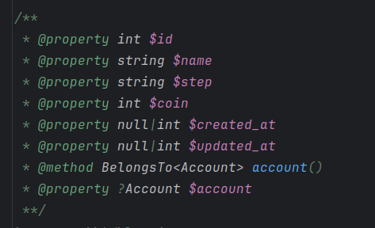

# Guide

## Command Line

Use this command to update the guide:

```shell
php artisan guide+
```




## Warning

> This feature is not tested in the production mode
> and big projects.
> You know, `guide+` will change your model files.
> So please get backup before testing this feature, and
> if you find a bug, please report it in my telegram account
> [@MahdiSaremi](https://t.me/MahdiSaremi), or just PR.
> 
> Thanks

## Present

Presented attributes will generate:

```php
public function present()
{
    $this->id();
    $this->string('name');
}
```

Output document:

```php
/**
 * @property int $id
 * @property string $name
 */
```

### Hint

Customize the hint document by `typeHint` and `docHint`:

```php
public function present()
{
    $this->string('name')->typeHint(MyString::class . '|string')->docHint('This is a test string');
}
```

Output document:

```php
/**
 * @property MyString|string $name This is a test string
 */
```


## Model Attributes

Laravel model attributes will generate as well:

```php
public function getFullNameAttribute() : string
{
    return $this->firstName . ' ' . $this->lastName;
}

public function setFamilyAttribute(string|int $value)
{
    $this->lastName = $value;
}
```

Output document:

```php
/**
 * @property string $full_name
 * @property string|int $family
 */
```


## Marked With Attributes

Mark what you want with `DocblockAttributeContract` interface attribute to
generate in the docblock output.

### Is Relation

Mark the relating methods to generate in the docblock:

```php
#[IsRelation]
public function user()
{
    return $this->belongsTo(User::class);
}
```

Output document:

```php
/**
 * @property ?User $user
 */
```


## Labels

Label translator is supported as well:

```php
class UserLabelTranslator extends LabelTranslator
{
    public function name(bool $emoji = false)
    {
        return '...';
    }
    
    public function gender(bool $emoji)
    {
        return '...';
    }
}
```

Output document:

```php
/**
 * @property string $name_label
 * @property string name_label(bool $emoji = false)
 * @property string gender_label(bool $emoji)
 */
```

## Docblock vs Mixin

Set the config `laplus.guide.type` to `docblock` or `mixin`
to see the different.

### Docblock

Docblock will generate the output documents in the model
class file like this:

```php
/**
 * @Guide
 * @property int $id
 * @property string $name
 * @EndGuide
 */
class User extends Model
```

### Mixin

Mixin is the better way to add documentation to the class.

Mixin will create a random class and add the documents in
that file:

```php
<?php

namespace Rapid\_Stub;

/**
 * @property int $id
 * @property string $name
 */
class _b10a8db164e0754105b7a99be72e3fe5 { }
```

Then add this class as `@mixin` to the actual model:

```php
/**
 * @Guide
 * @mixin \Rapid\_Stub\_b10a8db164e0754105b7a99be72e3fe5
 * @EndGuide
 */
class User extends Model
```

Mixin keeps your code simple and readable :)
